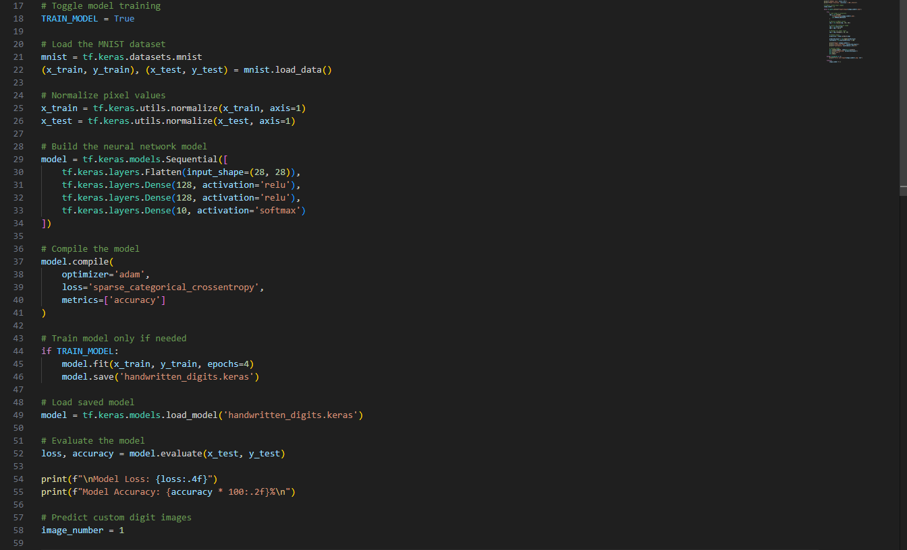
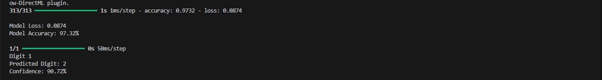
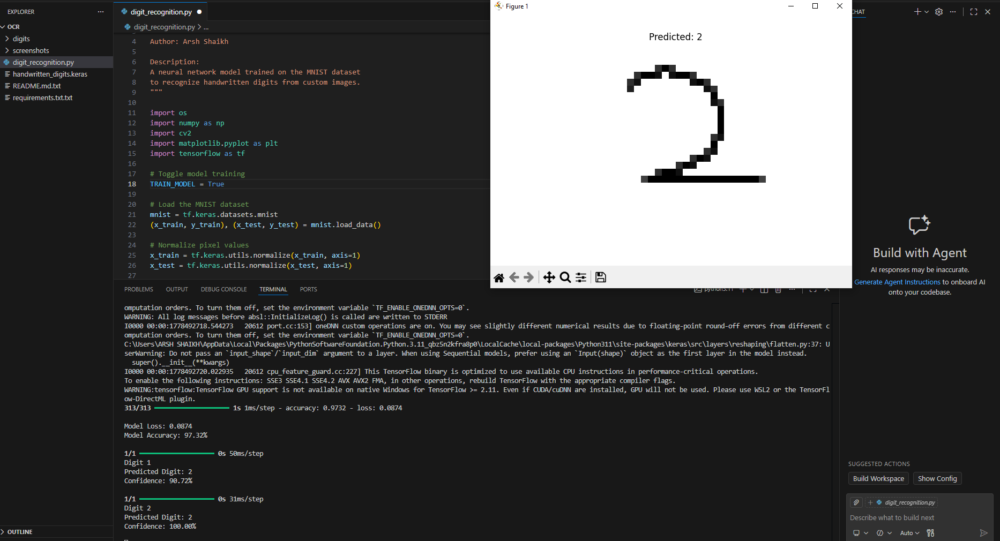

# Handwritten Digit Recognition

A neural network-based handwritten digit recognition system built using TensorFlow and the MNIST dataset.

The model is trained to recognize handwritten digits from custom images and predict them with confidence scores.

---

## Features

- Handwritten digit recognition using TensorFlow
- Neural network trained on the MNIST dataset
- Custom image prediction support
- Confidence score prediction
- Image preprocessing and normalization
- Matplotlib visualization
- Model saving and loading using Keras

---

## Technologies Used

- Python
- TensorFlow
- NumPy
- OpenCV
- Matplotlib

---

## Project Structure

```plaintext
handwritten-digit-recognition/
│
├── digit_recognition.py
├── handwritten_digits.keras
├── requirements.txt
├── README.md
│
├── digits/
│   ├── digit1.png
│   ├── digit2.png
│
├── screenshots/
│   ├── model-code.png
│   ├── prediction-results.png
│   ├── project-demo.png
```

---

## Installation

Clone the repository:

```bash
git clone https://github.com/ArshDev-0/handwritten-digit-recognition.git
```

Install dependencies:

```bash
pip install -r requirements.txt
```

Run the project:

```bash
python digit_recognition.py
```

---

## Screenshots

### Neural Network Architecture


### Prediction Results


### Complete Project Demo


---

## Model Performance

- Accuracy: ~97%
- Loss: ~0.08

---

## Future Improvements

- Real-time webcam digit recognition
- CNN-based architecture
- GUI application
- Support for multi-digit recognition

---

## Author

Arsh Shaikh
